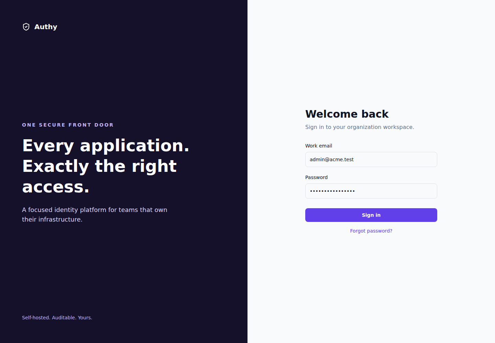
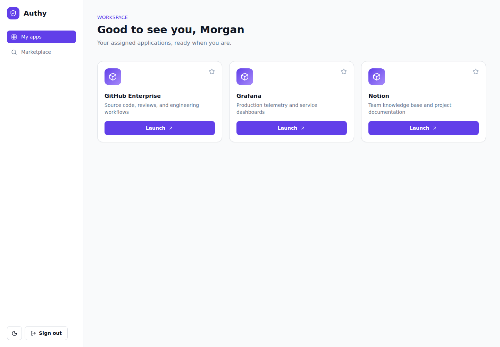
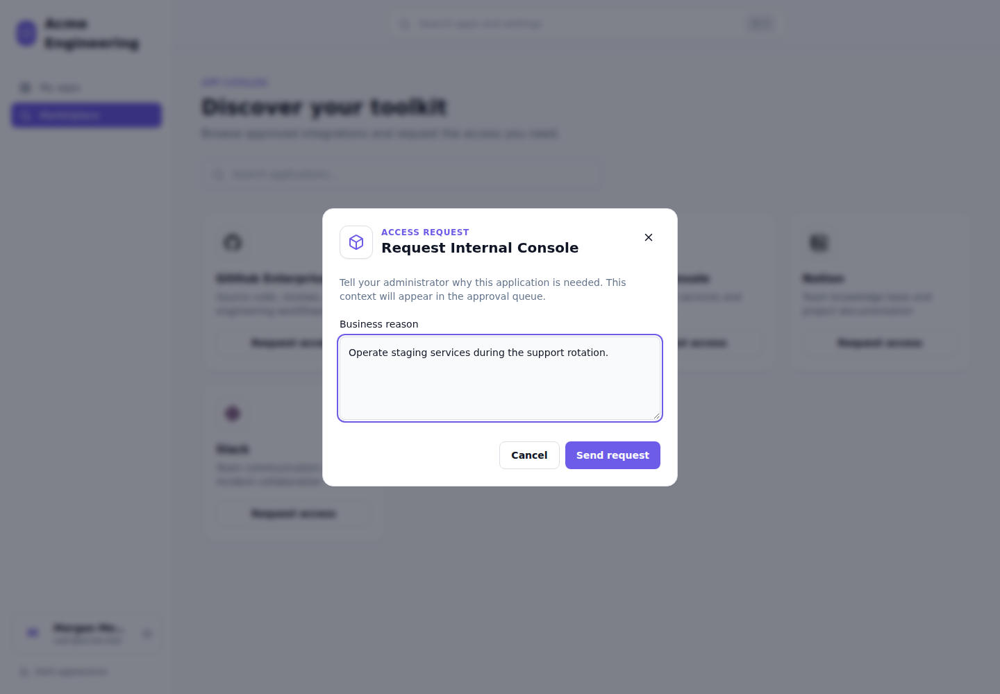
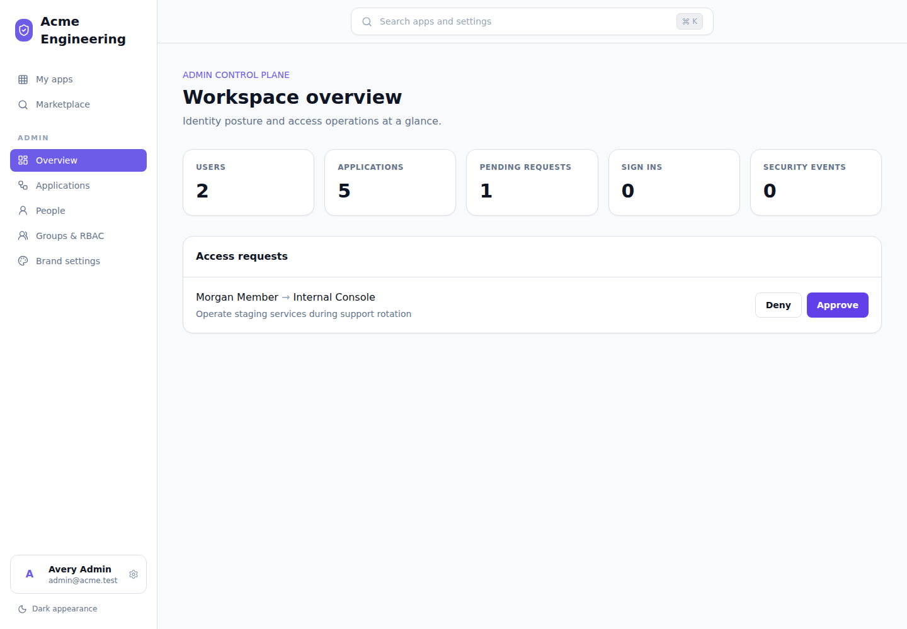
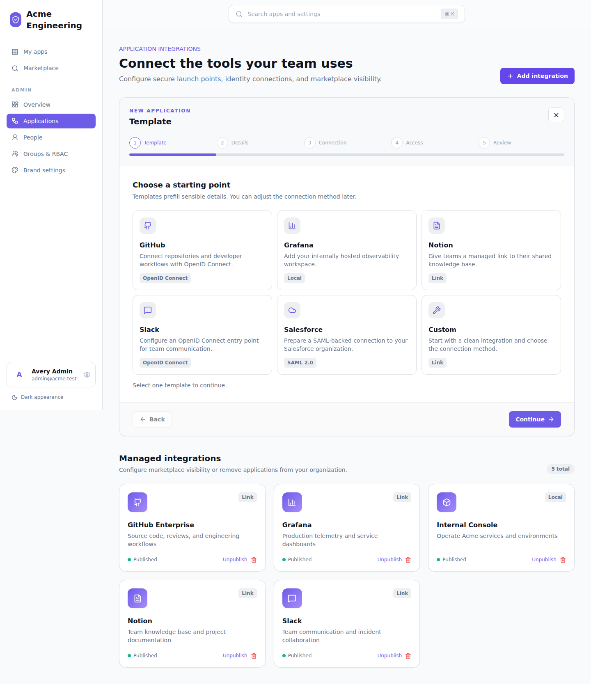
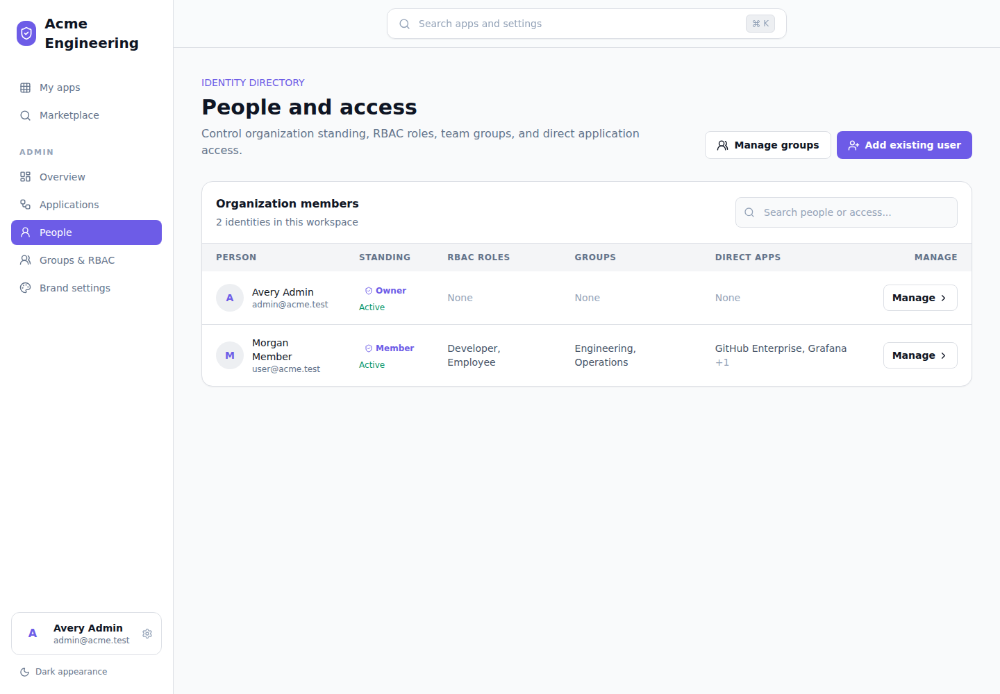
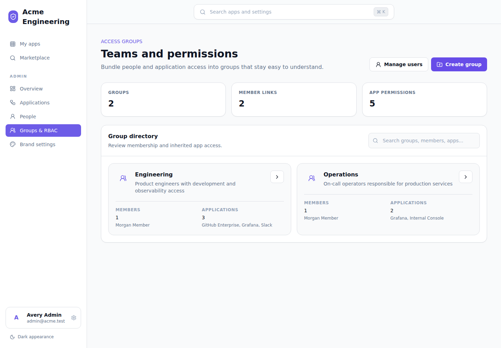
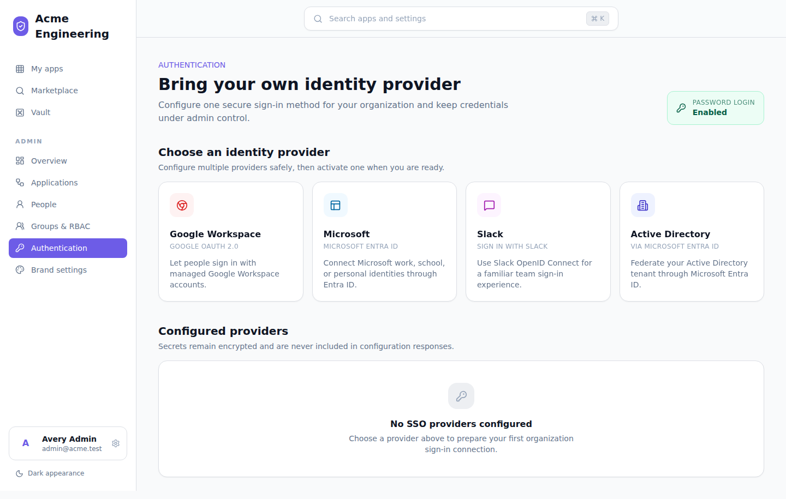
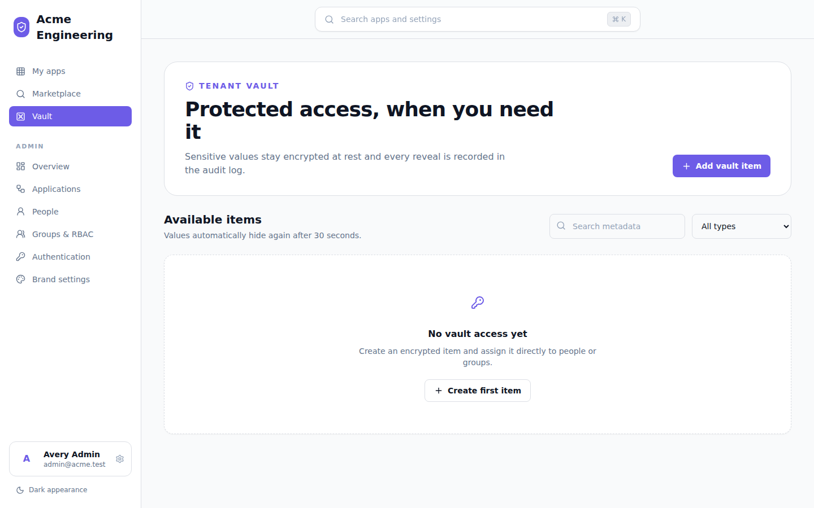

# Authy


Authy is a modern, self-hosted identity and application access platform inspired by Okta. It gives teams one secure portal for discovering applications, requesting access, launching assigned tools, and administering identities and permissions.

The complete platform is a deliberately simple Next.js modular monolith. The UI, REST API, authentication, authorization, integrations, and business logic ship as one application backed by PostgreSQL. There are no workers, queues, caches, microservices, or orchestration dependencies.

## Screens

### Secure Sign-In

The focused sign-in experience resolves each organization policy before using Better Auth credentials, Google Workspace, Microsoft, Slack, or Microsoft Entra ID. Enabling SSO disables password sign-in for that organization.



### User Portal

Assigned third-party and internally owned applications are presented in a responsive five-column launch dashboard with platform icons and recent activity. Press `Cmd+K` or `Ctrl+K` from any portal page to open the Spotlight-style application and settings search.



### Marketplace Requests

Members can discover published tools and send a contextual access request without leaving the portal.



### Admin Portal

Administrators can monitor identity metrics and approve or deny tenant-scoped access requests from one control plane.



### Application Onboarding

The integration wizard guides administrators through a platform template, details, connection protocol, publication policy, and final review. OIDC, SAML, local, and managed-link applications are supported.



### Users And Individual Access

Each organization member can hold multiple RBAC roles and groups alongside direct application assignments. Administrators can also suspend accounts or change organization standing.



### Groups And RBAC

Groups bundle membership and inherited application permissions into reusable, auditable access profiles.



## Capabilities

- Better Auth email/password sign-in, sign-out, recovery hooks, secure sessions, and HTTP-only cookies
- Admin-managed Google Workspace, Microsoft, Slack, and Microsoft Entra ID SSO with encrypted provider secrets
- Entra-backed Active Directory support for cloud or federated directories
- One-time fresh-install owner setup with no seeded users or shared demo passwords
- Admin-generated users with emailed temporary credentials and mandatory first-login password rotation
- Animated password-strength guidance and a skippable, auto-navigating product tour
- Encrypted tenant Vault for passwords, secrets, and environment variables with direct/group access
- Strict organization membership checks on every protected domain query
- User and administrator capability separation with owner, admin, and member roles
- Searchable application marketplace for OIDC, SAML, link, local, and internal applications
- Spotlight-style global search for assigned applications, admin tools, and account settings
- Guided application integration wizard with platform templates and protocol-aware validation
- Direct and group application assignments with application-specific entitlements
- Five-column application launcher with platform icons, favorites, and recent-use data
- Access-request creation, review, approval, denial, and automatic assignment
- Full user access management across organization roles, multiple RBAC roles, groups, and apps
- Group creation, editing, deletion, membership, and inherited application permissions
- Organization greeting, logo, and primary-color settings with a live preview
- One-time service credential display with hashed storage, rotation-ready metadata, and revocation
- Tenant metrics for users, applications, requests, sign-ins, and security events
- Admin-managed Resend delivery with encrypted credentials, test sends, and WYSIWYG transactional templates
- Composio-compatible integration boundary with a seeded local catalog adapter
- Versioned, validated REST endpoints and an OpenAPI 3 specification
- Dark and light themes, responsive layouts, keyboard focus states, and accessible controls

## Quick Start

Requirements: Docker with the Compose plugin.

```bash
cp .env.example .env
# Replace POSTGRES_PASSWORD and BETTER_AUTH_SECRET in .env.
docker compose up --build -d
```

Open [http://localhost:3000](http://localhost:3000). A fresh database redirects to `/setup`, where you create the organization and its first owner. Setup is permanently disabled as soon as the first user exists.

The application container applies committed migrations before starting. PostgreSQL data is retained in the `authy-postgres` Docker volume.

For Dokploy, select `docker-compose.dokploy.yml`, expose the `app` service on container port `3000`, and configure `POSTGRES_PASSWORD`, `BETTER_AUTH_SECRET`, and `BETTER_AUTH_URL` in the Compose environment. Add the `OIDC_CLIENT_*` variables described below when Authy will provide sign-in to another application. The deployment file intentionally publishes no host ports because Dokploy routes traffic through Traefik.

## Local Development

Use Node.js 22.12 or newer and a PostgreSQL instance. Set `DATABASE_URL` in the root `.env` to an address reachable from the host, then run:

```bash
npm install
npm run db:migrate
npm run db:seed
npm run dev
```

The root `.env` provides the initial runtime configuration. Use `INTEGRATION_MODE=mock` to print generated credentials to the application console for local development, or set it to `live` and supply `RESEND_API_KEY` plus `EMAIL_FROM` as an installation-level fallback. An organization-level Resend configuration takes precedence once saved. `BETTER_AUTH_SECRET` also derives the AES-256-GCM key used for SSO, Vault, and Resend secrets, so back it up and do not rotate it without re-encrypting stored values.

## Authentication And Directory Setup

Owners configure workforce sign-in under **Admin > Authentication**. Copy the callback URL shown for the provider into its OAuth application, enter the client credentials, then activate the connection. Only one provider can be active for an installation because Better Auth provider identifiers are process-wide. Activation is transactional and disables email/password login for the organization; deleting or disabling the final active provider restores it.



Google Workspace can be restricted with a hosted-domain hint. Microsoft and Active Directory connections require a Microsoft Entra tenant ID. On-premises Active Directory must be synchronized or federated to Entra ID, or exposed through a standards-compatible OIDC bridge; this application does not accept LDAP binds or Kerberos credentials directly.

### Downstream OIDC Integration

Authy can act as an OpenID Connect provider for one trusted confidential client. It implements the authorization-code flow with S256 PKCE, signed ID tokens, UserInfo, refresh tokens, and discovery. Dynamic client registration is disabled; the operator registers the trusted client through environment variables.

#### Configure Authy

Set the following variables on the Authy server:

```dotenv
BETTER_AUTH_URL=https://auth.example.com
OIDC_CLIENT_ID=platform-production
OIDC_CLIENT_SECRET=replace-with-at-least-32-random-characters
OIDC_REDIRECT_URI=https://platform.example.com/auth/callback

# Optional application-catalog metadata
OIDC_CLIENT_NAME=Example Platform
OIDC_CLIENT_DESCRIPTION=Sign in to Example Platform with Authy
OIDC_CLIENT_LAUNCH_URL=https://platform.example.com/sign-in
```

Generate a client secret with a cryptographically secure tool, for example `openssl rand -hex 32`. Configure the same client ID and secret in the downstream application, but never expose the secret to browser code or commit it to source control.

`OIDC_REDIRECT_URI` is matched exactly. Its scheme, host, port, path, query, and trailing slash must match the URI sent in authorization and token requests. Use an HTTPS callback in production.

Restart Authy after changing these variables. The OIDC provider is enabled only when `OIDC_CLIENT_ID`, `OIDC_CLIENT_SECRET`, and `OIDC_REDIRECT_URI` are all present.

#### Discover Endpoints

Clients should use discovery instead of hard-coding individual endpoints:

```text
https://auth.example.com/api/auth/.well-known/openid-configuration
```

The discovery document advertises endpoints under the configured `BETTER_AUTH_URL`:

| Purpose          | Endpoint                     |
| ---------------- | ---------------------------- |
| Authorization    | `/api/auth/oauth2/authorize` |
| Token exchange   | `/api/auth/oauth2/token`     |
| UserInfo         | `/api/auth/oauth2/userinfo`  |
| JSON Web Key Set | `/api/auth/jwks`             |

Verify discovery after deployment:

```bash
curl -fsS \
  https://auth.example.com/api/auth/.well-known/openid-configuration
```

`BETTER_AUTH_URL` must be the public HTTPS origin seen by users and the downstream client. An internal container URL produces an incorrect issuer and endpoint metadata.

#### Configure The Downstream Client

Use these values in a standards-compatible OIDC client library:

| Setting              | Value                                                          |
| -------------------- | -------------------------------------------------------------- |
| Issuer               | The public `BETTER_AUTH_URL` value                             |
| Discovery URL        | `${BETTER_AUTH_URL}/api/auth/.well-known/openid-configuration` |
| Client ID            | The `OIDC_CLIENT_ID` value                                     |
| Client secret        | The `OIDC_CLIENT_SECRET` value                                 |
| Redirect URI         | The exact `OIDC_REDIRECT_URI` value                            |
| Response type        | `code`                                                         |
| Scopes               | `openid profile email`                                         |
| PKCE method          | `S256`                                                         |
| Token authentication | `client_secret_basic` or `client_secret_post`                  |

The client should generate a new `state`, `nonce`, and PKCE verifier for each authorization request. After Authy redirects to the registered callback with an authorization code, the client backend exchanges the code together with the original verifier. Do not perform the token exchange from public browser code.

Add `offline_access` to the requested scopes when the application needs a refresh token, and store refresh tokens only in encrypted server-side storage.

Validate ID tokens with the discovery document and JWKS. At minimum, verify the signature, `iss`, `aud`, `exp`, and `nonce` before creating an application session. Use `sub` as the stable Authy account identifier. Request the `email` scope and reject the identity unless `email_verified` is exactly `true`; email addresses alone are not stable account identifiers.

The access token can be sent as a bearer token to the advertised UserInfo endpoint when the client needs a fresh profile:

```http
GET /api/auth/oauth2/userinfo HTTP/1.1
Host: auth.example.com
Authorization: Bearer ACCESS_TOKEN
```

#### Application Catalog

`OIDC_CLIENT_NAME`, `OIDC_CLIENT_DESCRIPTION`, and `OIDC_CLIENT_LAUNCH_URL` are optional. When a launch URL is present, Authy creates or updates a published OIDC application at startup and assigns it idempotently to current members of the first organization. The launch URL should point to the downstream application's sign-in entry point.

If initial Authy setup has not created an organization yet, catalog provisioning is deferred. Restart Authy after setup or assign the application manually. Users added after the last startup can be assigned by an administrator or included during the next restart.

#### Current Constraints

- One environment-configured trusted downstream client is supported at a time.
- Dynamic client registration is disabled.
- Redirect URIs are exact-match and only one URI can be configured through the environment.
- S256 PKCE is mandatory; the plain challenge method is rejected.
- The client is responsible for validating tokens and verified-email claims.

Multiple simultaneous platform integrations require extending Authy with persistent OIDC client management rather than sharing one client ID or secret between applications.

#### Troubleshooting

| Symptom                          | Check                                                                                               |
| -------------------------------- | --------------------------------------------------------------------------------------------------- |
| Discovery returns internal hosts | Set `BETTER_AUTH_URL` to the public HTTPS origin and restart Authy.                                 |
| `invalid_client`                 | Confirm the client ID and secret match on both systems and all required Authy variables are set.    |
| Redirect URI error               | Compare the complete URI, including scheme, port, path, and trailing slash.                         |
| Authorization fails before login | Confirm the request uses `response_type=code`, includes `openid`, and sends an S256 code challenge. |
| Token exchange fails             | Send the same redirect URI and PKCE verifier used for the authorization request.                    |
| No application tile appears      | Set `OIDC_CLIENT_LAUNCH_URL`, complete organization setup, and restart Authy.                       |
| User is rejected by the client   | Confirm Authy returns `email`, `email_verified: true`, and the requested profile claims.            |

## Email Delivery

Owners and administrators configure Resend under **Admin > Email delivery**. Create a restricted sending API key in Resend, verify the sender domain, save the sender identity, and send a test message before enabling delivery. API keys are encrypted at rest and never returned by the API. Disabling the organization configuration pauses transactional delivery instead of falling back to environment credentials.

The message studio provides visual and source-HTML editing for new-user credentials, password resets, and organization invitations. Each template exposes only the placeholders available for that event, sanitizes saved HTML and links, supports a sandboxed sample preview, and can be restored to the system default. Changes affect future messages only.

Password recovery uses an organization template only when the user belongs to exactly one organization. Installations that permit multi-organization membership must also configure the trusted `RESEND_API_KEY` and `EMAIL_FROM` environment fallback so no tenant administrator controls a shared account's reset token. Delivery failures are logged while the public recovery response remains indistinguishable from an unknown account.

Administrators create workforce identities under **Admin > People** with first name, last name, email, company role, organization standing, RBAC roles, groups, and direct application access. New credential users receive a random multi-word temporary password by email. Their first session is restricted to password rotation, followed by a skippable guided tour.

The **Vault** stores credential pairs, opaque secrets, and environment variable blocks. Values are encrypted at rest, omitted from list responses, scoped through user or group assignments, revealed only on demand, hidden again after 30 seconds, and audited on every reveal. Vault items are intentionally separate from OAuth, OIDC, and SAML application integrations.



## Architecture

```text
Browser / Internal application
              |
     Next.js modular monolith
     |       |       |       |
    UI   Better Auth REST  Domain modules
                     API       |
                         Prisma/PostgreSQL
```

```text
src/
  components/          Reusable portal UI
  hooks/               Typed browser data hooks
  lib/                 Database, environment, and API contracts
  modules/
    applications/      Catalog, assignment, and access policies
    audit/             Sensitive-operation audit trail
    auth/              Better Auth client, server, and tenant context
    integrations/      Resend and Composio-compatible adapters
    security/          Credentials and request rate limiting
    users/             Password policy and temporary credential generation
    vault/             Encrypted Vault schemas and access policy
  pages/
    api/auth/           Better Auth handler
    api/v1/             Versioned platform API
    admin.tsx           Administrator control plane
    admin-applications  Integration catalog and onboarding wizard
    admin-groups        Group membership and inherited permissions
    admin-authentication SSO and directory provider configuration
    admin-settings      Organization branding and greeting
    admin-users         Identity roles, groups, and direct assignments
    index.tsx           Assigned application dashboard
    marketplace.tsx     Application discovery and requests
    profile.tsx         User identity and session settings
    setup.tsx           One-time first-owner installation wizard
    vault.tsx           Assigned secrets and administrator Vault controls
prisma/                 Schema, migrations, and deterministic seed
tests/                  Jest, RTL, and Playwright suites
```

Route handlers validate transport input and delegate policy and business decisions to domain modules. Provider-specific code remains behind adapters. PostgreSQL is accessed directly through Prisma from the same deployable process.

## Platform API

All platform endpoints are versioned under `/api/v1` and return typed data envelopes or consistent errors:

```json
{
  "error": {
    "code": "FORBIDDEN",
    "message": "Administrator access required"
  }
}
```

Available resources include:

- `GET /api/v1/me` for identity, tenant role, roles, and permissions
- `GET|POST /api/v1/applications` for discovery and registration
- `POST /api/v1/applications/{id}/assignments` for user or group assignment
- `GET /api/v1/applications/{id}/launch` for access-checked application launch
- `GET|POST /api/v1/access-requests` for request creation and lookup
- `PATCH /api/v1/access-requests/{id}` for administrator decisions
- `GET|POST /api/v1/api-keys` and `DELETE /api/v1/api-keys/{id}` for service credentials
- `GET /api/v1/audit-events` for paginated tenant audit events
- `GET /api/v1/admin/metrics` for administrator dashboard metrics
- `GET|PATCH /api/v1/admin/settings` for tenant branding
- `GET|POST /api/v1/admin/users` and `PATCH|DELETE /api/v1/admin/users/{id}` for member access
- `GET|POST /api/v1/admin/groups` and `PATCH|DELETE /api/v1/admin/groups/{id}` for group RBAC
- `GET|POST /api/v1/admin/auth-providers` for encrypted SSO configuration metadata
- `GET|POST /api/v1/vault`, `PATCH|DELETE /api/v1/vault/{id}`, and `POST /api/v1/vault/{id}/reveal` for encrypted secrets
- `GET /api/v1/setup/status` and one-time `POST /api/v1/setup` for fresh installations

The OpenAPI 3 document is served at [`/openapi.yaml`](public/openapi.yaml). OIDC application redirect URIs, scopes, and claims and practical SAML metadata are represented in the catalog model. Link and local applications use the access-checked launch endpoint. Authy's downstream OIDC provider exposes signed metadata and JWKS; cataloged SAML integrations remain metadata records and require an external SAML identity provider.

## Security Model

- Server-side authentication and role checks protect all privileged routes.
- Application, group, assignment, request, key, and audit lookups are scoped by organization.
- API keys use cryptographically random values, one-time secret disclosure, SHA-256 storage, and timing-safe comparison.
- Better Auth session cookies are HTTP-only and become secure in production.
- Redirect URIs and application URLs use validated schemas; privileged credentials never enter browser bundles.
- SSO client secrets and Vault values use authenticated AES-256-GCM encryption and are never returned in metadata APIs.
- Enabling SSO disables the Better Auth email/password endpoint for members of that organization.
- API requests use validation, request rate limits, stable error codes, and sensitive-operation audit logs.
- Default headers include CSP, frame denial, MIME sniffing prevention, referrer policy, and browser permission restrictions.

Before an internet-facing deployment, use high-entropy secrets, TLS at the reverse proxy, a dedicated database role, an external email domain, monitored backups, and provider-specific OIDC/SAML security review.

## Quality And Tests

```bash
npm run lint          # ESLint: TypeScript, React, hooks, imports, a11y
npm run typecheck     # Strict TypeScript without emitting
npm run format        # Write Prettier formatting
npm run format:check  # CI-safe formatting check
npm run test:unit
npm run test:integration
npm run test:coverage
npm run test:e2e
npm run test:all
```

Set `PLAYWRIGHT_BASE_URL=http://localhost:3000` to run browser tests against an existing local or Compose environment. Database integration suites use `.env.test`; `npm run db:reset:test` recreates isolated test data.

## Database Operations

```bash
# Create a development migration
npm run db:migrate:dev -- --name descriptive_name

# Apply committed migrations and optionally refresh role permissions
npm run db:migrate
npm run db:seed

# Backup
docker compose exec -T db pg_dump -U "$POSTGRES_USER" "$POSTGRES_DB" > authy-backup.sql

# Restore
cat authy-backup.sql | docker compose exec -T db psql -U "$POSTGRES_USER" "$POSTGRES_DB"
```

For upgrades, create and verify a backup, pull the new release, review its migration notes, and run `docker compose up --build -d`.

## License

MIT
